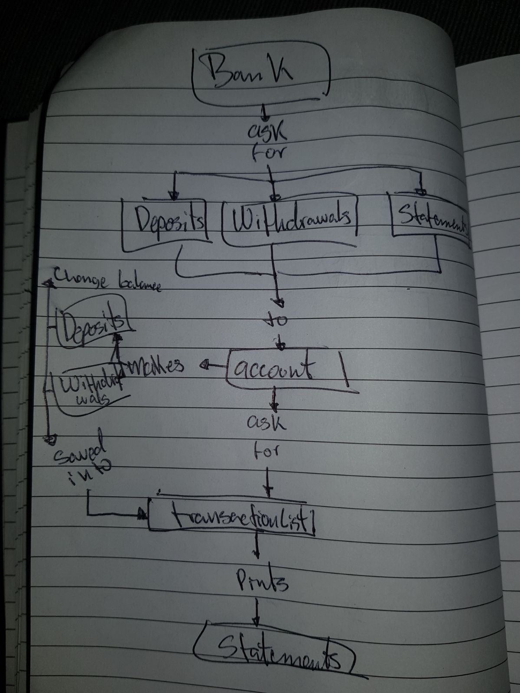
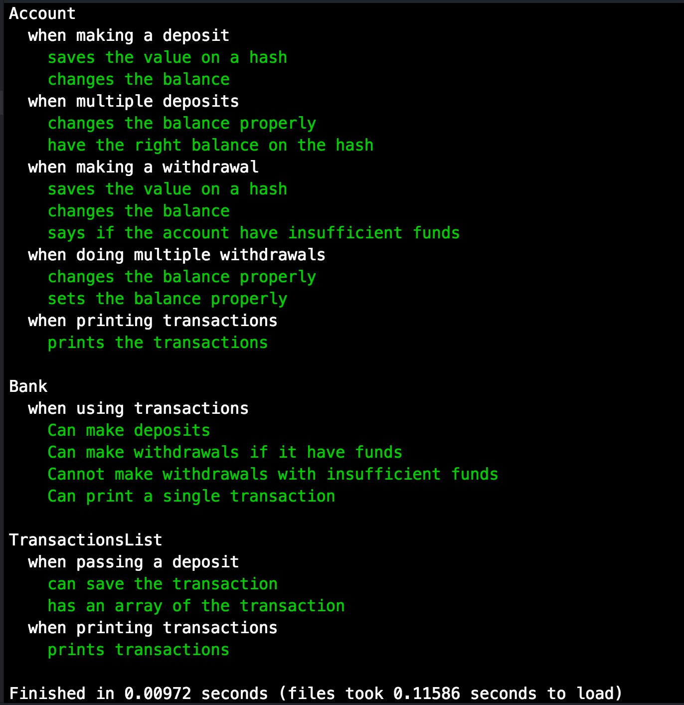
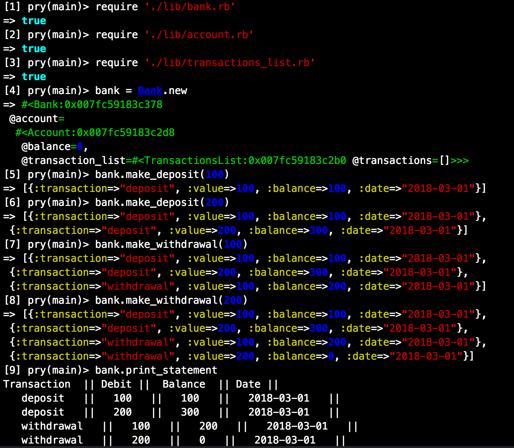
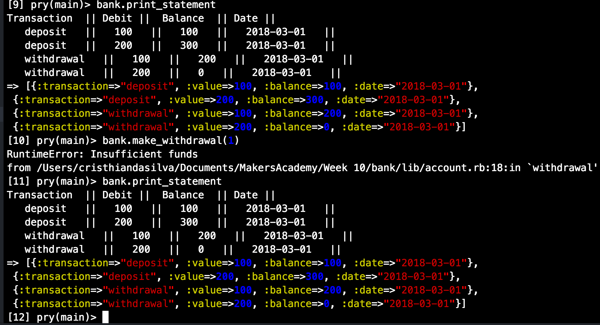

Bank tech-test[](https://travis-ci.org/cristhiandas/bank)[](https://coveralls.io/github/cristhiandas/bank?branch=master)
=================

It has been requested to create a banking system, the user stories are the following:

```
As a user,
So I can have money on my bank Account,
I want to be able of making deposits.

As a user,
So I can use my money,
I want to be able of making withdrawals.

As a user,
So I can check how much money I have left,
I want to print my statements with my transactions and my balance.

As a Bank,
So people don't take more money than they have,
I want the system to throw an error if someone tries to withdraw more money than the available.
```

## To solve the problem I followed this steps:
----
1- Created some user stories with the given information.

2- Made a simple chart with the basic idea of what I thought might work.

3- Made a simple test.

4- Passed the test.

5- refactored the code.

6- commited the result.

7- rechecked my logic thinking and chart.

8- repeated steps 3 to 7 until finished.

## Final chart


## To run the code
---

1- clone this repo.

2- run:
```
bundle install
```
to make sure you got all the gems then
```
bundle exec rspec
```
to check that all test are passing.

3- run:
```irb``` or ```pry```

4- ```require './lib/bank.rb'```, ```require './lib/account.rb'``` and ```require './lib/transactions_list.rb'```

## Passing tests


## Working example


now trying to take more money:

